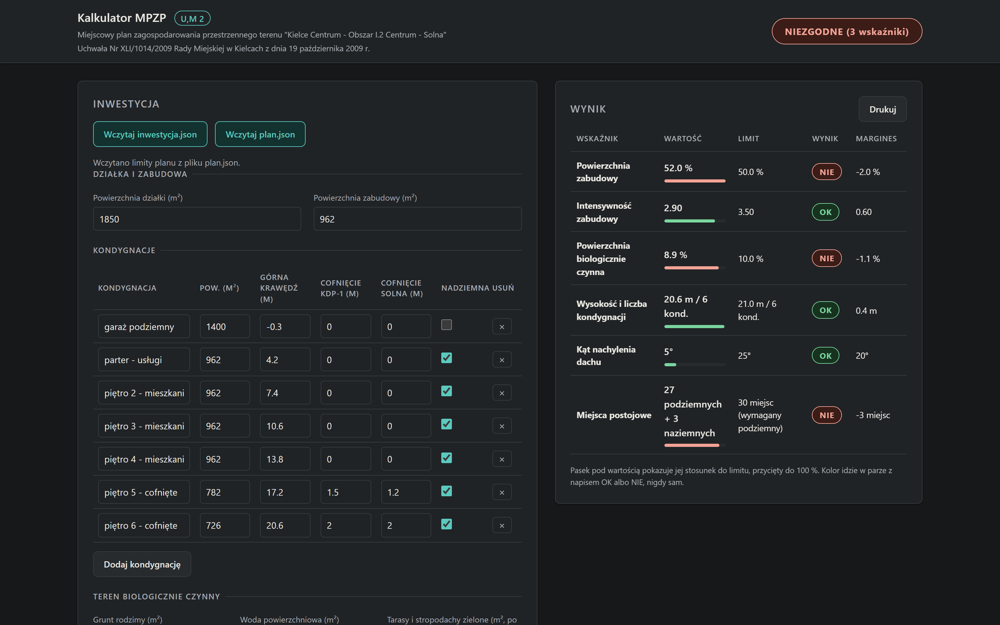

# Karta 04 - Kalkulator
**Poziom:** Samodzielnie (bez Rhino), poziom 2   **Czas:** 20 min   **Budżet:** 2-3 zapytania

## Cel
Na koniec masz jeden plik HTML, który otwierasz podwójnym kliknięciem i od razu widzisz tę samą tabelę sześciu wskaźników, przeliczaną na żywo przy każdej zmianie liczby w formularzu.
To narzędzie możesz pokazać klientowi na spotkaniu bez instalowania czegokolwiek.


*Kalkulator wzorcowy `rozwiazania/04_kalkulator.html` po wczytaniu plików `dane/inwestycja.json` i `rozwiazania/plan.json`.*

## Zanim zaczniesz
- Miej otwarty moje/sprawdz_mpzp.py z karty 01 - logika liczenia ma być ta sama, tylko przeniesiona do przeglądarki.
- Miej otwarte moje/plan.json i dane/inwestycja.json - stamtąd biorą się wartości domyślne w formularzu.

## Prompt krok po kroku
Każde zdanie promptu ma jedno zadanie i zamyka jedną drogę na skróty; poniżej prompt rozłożony na części w kolejności, w jakiej czyta je agent.

1. **"Turn moje/sprawdz_mpzp.py into a single HTML file moje/kalkulator.html"** - przeniesienie gotowej logiki z karty 01, a nie wymyślanie wskaźników od nowa; nazwa i folder pliku wynikowego.
2. **"a form pre-filled with every number from dane/inwestycja.json"** - formularz startuje z kompletem danych fikcyjnej inwestycji, łącznie z tabelą kondygnacji, więc po otwarciu nie ma pustych pól.
3. **"a second panel pre-filled with the limits from moje/plan.json (or rozwiazania/plan.json if it does not exist)"** - limity w osobnym panelu, oddzielone od danych budynku, z planem zapasowym, gdy karta 00 się nie udała.
4. **"two file inputs labelled Wczytaj inwestycja.json and Wczytaj plan.json that read a chosen JSON file into the form"** - bez tego zdania zostają same liczby wpisane na sztywno i nie podmienisz limitów na własne moje/plan.json z karty 00.
5. **"and the same six-row table with OK/NIE recalculated on every change"** - ten sam układ sześciu wierszy co w karcie 01; bez słowa "recalculated" agent robi kalkulator z przyciskiem "Przelicz".
6. **"with a verdict label reading ZGODNE or NIEZGODNE plus the number of failing rows declined in Polish"** - jedna etykieta zamiast czytania sześciu wierszy; odmiana musi się zgadzać, bo na danych ćwiczeniowych etykieta brzmi NIEZGODNE (3 wskaźniki).
7. **"Plain HTML, CSS and JavaScript in one file"** - jeden plik bez budowania i bez instalacji: wysyłasz go mailem i otwiera się u każdego.
8. **"no external scripts or fonts"** - zakaz CDN i Google Fonts; strona z zewnętrznym skryptem wygląda dobrze przy Wi-Fi, a na spotkaniu u klienta się rozjeżdża.
9. **"must work offline when double-clicked"** - warunek dwukliku z dysku, bez serwera; dlatego pliki z punktu 4 wskazujesz w okienku wyboru, a nie pobiera ich fetch, którego przeglądarka z file:// nie wykona.
10. **"Open it and confirm the table matches the Python output."** - agent sam otwiera stronę i porównuje ją z wynikiem Pythona, więc rozjazd w rodzaju 8.9 % kontra 11.8 % wychodzi od razu.

## Prompt (skopiuj do Copilot Chat, tryb Agent)
```text
Turn moje/sprawdz_mpzp.py into a single HTML file moje/kalkulator.html: a form pre-filled with every number from dane/inwestycja.json, a second panel pre-filled with the limits from moje/plan.json (or rozwiazania/plan.json if it does not exist), two file inputs labelled Wczytaj inwestycja.json and Wczytaj plan.json that read a chosen JSON file into the form, and the same six-row table with OK/NIE recalculated on every change, with a verdict label reading ZGODNE or NIEZGODNE plus the number of failing rows declined in Polish (1 wskaźnik, 3 wskaźniki, 5 wskaźników). Plain HTML, CSS and JavaScript in one file, no external scripts or fonts, must work offline when double-clicked. Open it and confirm the table matches the Python output.
```

## Jak otworzyć kalkulator

Kalkulator jest zwykłą stroną na dysku, więc otwierasz go dwuklikiem z Eksploratora Windows, nie z VS Code; poniżej każde kliknięcie po kolei.

1. W lewej kolumnie VS Code rozwiń folder `moje` i sprawdź, że leży w nim plik `kalkulator.html`. Nie ma go? Napisz agentowi: "zapisz stronę do pliku moje/kalkulator.html".
2. Kliknij ten plik prawym przyciskiem i wybierz `Reveal in File Explorer` (menu VS Code są po angielsku; skrót Shift+Alt+R). Otwiera się okno Eksploratora Windows z zaznaczonym plikiem.
3. Kliknij plik dwukrotnie - otwiera się w przeglądarce: po lewej formularz z danymi inwestycji i limitami planu, po prawej tabela sześciu wskaźników.
4. Plik otworzył się w Notatniku albo w edytorze kodu? Kliknij go prawym przyciskiem, wybierz `Otwórz za pomocą` i wskaż przeglądarkę.
5. Zmień dowolną liczbę w formularzu i przejdź do następnego pola - tabela przelicza się od razu, bez klikania czegokolwiek.
6. Wczytanie własnych danych: kliknij przycisk `Wczytaj plan.json`, w oknie wyboru pliku przejdź do folderu repozytorium, do podfolderu `moje`, i wskaż `plan.json` z karty 00. Tym samym sposobem, przyciskiem `Wczytaj inwestycja.json`, wczytujesz `dane/inwestycja.json`.
7. Po każdej poprawce agenta wróć do okna przeglądarki i naciśnij F5 - strona wczytuje się na nowo z dysku.
8. Nie otwieraj strony przez `Open with Live Server` ani przez podgląd w VS Code: ma działać dwuklikiem z dysku, tak jak u klienta na spotkaniu.

## Sprawdź
- tabela w przeglądarce pokazuje te same sześć wyników co w karcie 01: powierzchnia zabudowy 52.0 % NIE, intensywność 2.90 OK, PBC 8.9 % NIE, wysokość 20.6 m / 6 kond. OK, dach 5° OK, parking NIE (margines -3 miejsc).
- przyciski Wczytaj inwestycja.json i Wczytaj plan.json otwierają okno wyboru pliku i wczytują wskazany plik JSON do formularza; po wczytaniu etykieta wyniku pokazuje NIEZGODNE (3 wskaźniki).
- zmiana dowolnej liczby w formularzu przelicza tabelę bez odświeżania strony.
- plik otwiera się dwuklikiem z dysku i działa bez połączenia z siecią (wyłącz Wi-Fi i sprawdź ponownie).

## Jeśli nie działa
- Jeśli tabela się nie przelicza, każ agentowi dodać nasłuchiwanie na zdarzenie input na każdym polu formularza.
- Wzorcowe rozwiązanie: rozwiazania/04_kalkulator.html.
