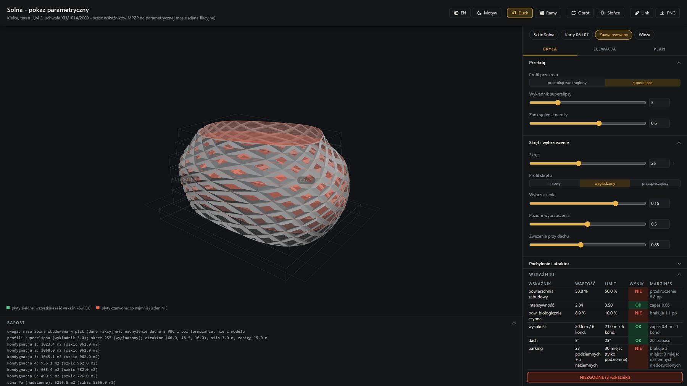

# Karta 08 - Pokaz w przeglądarce
**Poziom:** Pokaz (po warsztacie, bez Rhino)   **Czas:** 60-90 min pracy agenta   **Budżet:** sesja agentowa z Claude Opus 5 (Claude Code albo płatny Copilot), około 30 zapytań, więcej niż miesięczny limit Copilot Free

## Cel
Na koniec masz jeden plik HTML, który po dwukliku pokazuje masę Solna jako model 3D w przeglądarce: suwaki bryły z karty 06, elewacja z karty 07, kontrola planu z karty 05 i raport, wszystko w jednym oknie, z presetami, linkiem do udostępnienia i eksportem PNG.
Prompt uruchamia zespół agentów: jeden planuje, kolejni implementują zadania, inni je sprawdzają, a na końcu osobny agent próbuje rozwiązanie zepsuć.


*`rozwiazania/08_pokaz.html` zaraz po otwarciu w przeglądarce: bryła, elewacja, kontrola planu i raport w jednym oknie.*

## Zanim zaczniesz
- Przeczytaj karty 05, 06 i 07 oraz `przyklady/README.md`: pokaz przenosi do przeglądarki oba przykłady zaawansowane i kontrolę z karty 05.
- Miej zainstalowany node (test `node rozwiazania/08_test.js`) i połączenie z internetem: three.js ładuje się z CDN przy każdym otwarciu pliku.
- Ta karta to pokaz pracy agentowej dla chętnych po warsztacie, poza programem sali.

## Prompt krok po kroku
Każde zdanie promptu ma jedno zadanie i zamyka jedną drogę na skróty; poniżej prompt rozłożony na części w kolejności, w jakiej czyta je agent.

1. **"Build moje/08_pokaz.html: one HTML file that shows the Solna massing from rozwiazania/05_szkic_bryly_rhino.py as a three.js model (three@0.186.1 through a jsdelivr import map, nothing else external)"** - wynik idzie do folderu moje, jedynego, do którego wolno pisać; masa pochodzi z karty 05, a przypięta wersja three.js jest jedynym adresem zewnętrznym, jaki test przepuszcza.
2. **"re-implements in JavaScript the geometry of przyklady/bryla_zaawansowana_gh.py and przyklady/elewacja_zaawansowana_gh.py plus the six-row check of rozwiazania/05_sprawdz_mpzp_gh.py"** - trzy pliki Pythona przepisane funkcja po funkcji; kontrola zachowuje stałą kolejność wierszy: zabudowa, intensywność, PBC, wysokość, dach, parking.
3. **"with every slider and number input of those components as a live control ... roof slope and the PBC areas added as plain form fields, and the storey plates coloured by the verdict"** - suwaki i pola zastępują kable Grasshoppera; nachylenie dachu dochodzi osobno, bo karta 05 nie ma takiego wejścia, a powierzchnie PBC wpisujesz liczbą zamiast rysować krzywe.
4. **"Dark showcase interface with a light toggle, Polish with an English switch, a side panel with tabs Bryła, Elewacja and Plan and collapsible sections inside them"** - motyw, język i panel boczny z trzema zakładkami; zwijane sekcje mieszczą wszystkie kontrolki w jednym oknie, a do zakładki Plan odsyła potem sekcja Sprawdź.
5. **"the six-row table collapsible to six result chips beside a ZGODNE / NIEZGODNE verdict, a collapsible report, both starting collapsed below 1000 px of viewport height"** - bez tego zdania tabela zasłania scenę na projektorze 768 px; zwinięta zostawia sześć chipów i jedno słowo werdyktu, a kliknięcie w chip ją rozwija.
6. **"presets (sketch, cards 06 and 07, advanced, tower), a ghost of the original massing, turntable, sun sweep, state in the URL hash and PNG export"** - cztery nastawy do pokazania jednym kliknięciem i pięć narzędzi pokazu; nastawy siedzą w adresie strony, więc link odtwarza je u sąsiada, ale bez widoku kamery.
7. **"The sketch preset must reproduce card 01's table exactly, so keep a rounded rectangle with zaokraglenie 0 as the exact polygon"** - jedyne zdanie wiążące pokaz z kartą 01; wielokąt musi zostać dokładny, inaczej preset szkicu przestanie dawać 962 m2 na kondygnację i 52.0 % zabudowy.
8. **"Keep the pure geometry between ... with no imports and no DOM, so node rozwiazania/08_test.js moje/08_pokaz.html can run it against rozwiazania/08_wzorzec.json"** - arytmetyka odcięta od strony dwoma znacznikami, bo node uruchamia sam ten blok, bez przeglądarki, i porównuje jego liczby z wartościami z Rhino.
9. **"Work as subagent-driven development: write a short spec and a task plan first"** - trzech tysięcy linii nie da się napisać jedną odpowiedzią; spis zadań pozwala wrócić do pracy po przerwanej sesji i policzyć postęp.
10. **"dispatch one implementer subagent per task and a reviewer after each"** - każde zadanie dostaje świeży kontekst i osobnego recenzenta, więc błąd nie jedzie dalej razem z tysiącem linii historii czatu.
11. **"gate every task on that test printing SELFTEST OK"** - zadanie zamykasz dopiero, gdy `node rozwiazania/08_test.js moje/08_pokaz.html` wypisze SELFTEST OK; bez bramki zła liczba wychodzi dopiero na pokazie.
12. **"finish with one adversarial review of the whole file against the Python components ... Follow AGENTS.md"** - ostatni agent szuka rozjazdów z Pythonem, a odesłanie do AGENTS.md pilnuje polskich komunikatów, nazw ASCII i danych fikcyjnych.

## Prompt (skopiuj do Claude Code albo Copilot Chat z Claude Opus 5, tryb Agent)
```text
Build moje/08_pokaz.html: one HTML file that shows the Solna massing from rozwiazania/05_szkic_bryly_rhino.py as a three.js model (three@0.186.1 through a jsdelivr import map, nothing else external) and re-implements in JavaScript the geometry of przyklady/bryla_zaawansowana_gh.py and przyklady/elewacja_zaawansowana_gh.py plus the six-row check of rozwiazania/05_sprawdz_mpzp_gh.py, with every slider and number input of those components as a live control, the geometry inputs replaced by the built-in massing, roof slope and the PBC areas added as plain form fields, and the storey plates coloured by the verdict. Dark showcase interface with a light toggle, Polish with an English switch, a side panel with tabs Bryła, Elewacja and Plan and collapsible sections inside them, the six-row table collapsible to six result chips beside a ZGODNE / NIEZGODNE verdict, a collapsible report, both starting collapsed below 1000 px of viewport height, presets (sketch, cards 06 and 07, advanced, tower), a ghost of the original massing, turntable, sun sweep, state in the URL hash and PNG export. The sketch preset must reproduce card 01's table exactly, so keep a rounded rectangle with zaokraglenie 0 as the exact polygon. Keep the pure geometry between "// --- GEOMETRIA ---" and "// --- KONIEC GEOMETRII ---" with no imports and no DOM, so node rozwiazania/08_test.js moje/08_pokaz.html can run it against rozwiazania/08_wzorzec.json, the reference numbers captured from the Python components in Rhino. Work as subagent-driven development: write a short spec and a task plan first, dispatch one implementer subagent per task and a reviewer after each, gate every task on that test printing SELFTEST OK, and finish with one adversarial review of the whole file against the Python components, followed by the fixes it asks for. Follow AGENTS.md.
```

## Jak uruchomić pokaz

Pokaz sprawdzasz dwa razy: najpierw testem w terminalu, potem oczami w przeglądarce; poniżej każde kliknięcie po kolei.

1. Na górnej belce VS Code otwórz menu `Terminal`, wybierz `New Terminal` (menu VS Code są po angielsku) i sprawdź, że linia na dole kończy się nazwą `kielce-2026-warsztat`.
2. Wpisz polecenie testu i naciśnij Enter - ma wypisać `SELFTEST OK`:

```
node rozwiazania/08_test.js moje/08_pokaz.html
```

3. Komunikat `node: The term 'node' is not recognized`? Brakuje node - pobierz go ze strony nodejs.org, instalator LTS dla bieżącego użytkownika, i otwórz terminal na nowo. Sam pokaz otworzy się i bez node, tylko bez testu liczb.
4. Test pokazuje asercję, która nie przeszła? Skopiuj jej treść do czatu i poproś agenta o poprawkę; tolerancje siedzą w `rozwiazania/08_wzorzec.json`.
5. W lewej kolumnie VS Code rozwiń folder `moje`, kliknij `08_pokaz.html` prawym przyciskiem i wybierz `Reveal in File Explorer` (skrót Shift+Alt+R).
6. W oknie Eksploratora Windows kliknij plik dwukrotnie - otwiera się w przeglądarce. Włącz internet przed otwarciem: bibliotekę three.js strona pobiera z sieci przy każdym uruchomieniu.
7. Scena jest pusta? Naciśnij F12, przejdź na zakładkę `Console` i przeczytaj pierwszy czerwony komunikat - błąd o `three` oznacza brak internetu albo zmieniony adres biblioteki.
8. Panel po prawej ma trzy zakładki: `Bryła`, `Elewacja` i `Plan`. Presety wybierasz z listy u góry panelu, a zwinięte sekcje rozwijasz kliknięciem w ich nagłówek.
9. Po każdej poprawce agenta wróć do okna przeglądarki i naciśnij F5.

## Sprawdź
- Test z punktu 2 sekcji "Jak uruchomić pokaz" wypisuje `SELFTEST OK`; to samo polecenie bez nazwy pliku sprawdza rozwiązanie wzorcowe.
- Po otwarciu pokazu w przeglądarce (punkty 5 i 6 powyżej; rozwiązanie wzorcowe: `rozwiazania/08_pokaz.html`) preset "Szkic Solna" pokazuje tabelę z karty 01: powierzchnia zabudowy 52.0 % NIE, intensywność 2.90 OK, PBC 8.9 % NIE, wysokość 20.6 m / 6 kond. OK, dach 5° OK, parking NIE. Na ekranie niższym niż 1000 px (projektor 768 px, laptop 900 px) tabela i raport startują zwinięte: sześć chipów z wynikami i werdykt zostają widoczne, kliknięcie w chipy rozwija tabelę.
- Z presetu "Szkic Solna" zmniejsz `zwezenie` do 0.6, a na zakładce Plan ustaw `pbc_grunt_m2` na 200, `miejsca_naziemne` na 0 i `miejsca_podziemne` na 30 - wszystkie sześć wierszy przechodzi, werdykt zmienia się na ZGODNE, a płyty i pierścienie kondygnacji robią się zielone. Przesuń potem `wybrzuszenie` na 0.3 - wiersz powierzchni zabudowy wraca na NIE i kolor wraca na czerwony.
- Naciśnij przycisk słońca - azymut obiega 360°, a panele elewacji zmieniają głębokość i kolor.
- Skopiuj link i otwórz go w nowej karcie - te same suwaki i ta sama tabela; widok kamery nie jest częścią linku.

## Jeśli nie działa
- Pusta scena i błąd w konsoli o `three` - brak internetu albo zmieniony import map; potrzebny jest dokładnie `three@0.186.1` z jsdelivr.
- Czarna scena w motywie jasnym - kolor tła renderera nie czyta zmiennej `--scena-tlo` po zmianie motywu.
- Bryła zawiązana w węzeł - szwy przekrojów się rozjechały; pierwszy punkt sterujący każdego przekroju ma leżeć na lokalnej osi +X obróconej o skręt tego przekroju.
- Liczby inne niż w Rhino - uruchom `node rozwiazania/08_test.js moje/08_pokaz.html` i czytaj pierwszą asercję, która nie przeszła; tolerancje są w `rozwiazania/08_wzorzec.json`.
- Wzorcowe rozwiązanie: `rozwiazania/08_pokaz.html` (test: `rozwiazania/08_test.js`, wartości z Rhino: `rozwiazania/08_wzorzec.json`, narzędzie prowadzącego: `narzedzia/wzorzec_08.py`).
